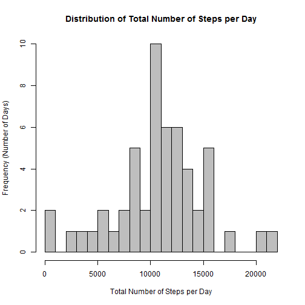
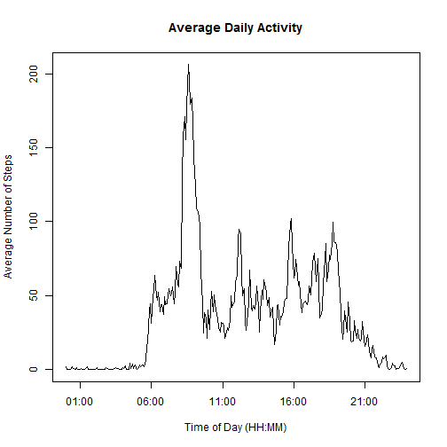
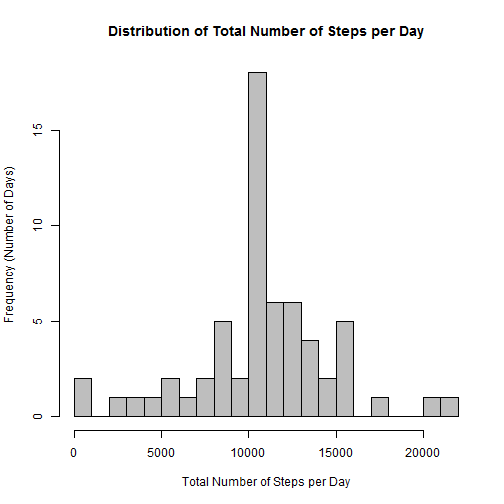
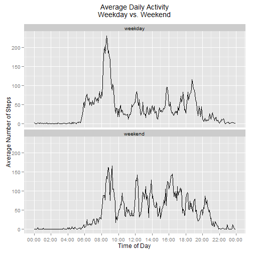

Reproducible Research - Peer Assessment 1
=========================================

## Introduction

It is now possible to collect a large amount of data about personal movement using activity monitoring devices such as a [Fitbit](http://www.fitbit.com/), [Nike Fuelband](http://www.nike.com/us/en_us/c/nikeplus-fuelband), or [Jawbone Up](https://jawbone.com/up). These type of devices are part of the "quantified self" movement - a group of enthusiasts who take measurements about themselves regularly to improve their health, to find patterns in their behavior, or because they are tech geeks. But these data remain under-utilized both because the raw data are hard to obtain and there is a lack of statistical methods and software for processing and interpreting the data.

This assignment makes use of data from a personal activity monitoring device. This device collects data at 5 minute intervals through out the day. The data consists of two months of data from an anonymous individual collected during the months of October and November, 2012 and include the number of steps taken in 5 minute intervals each day.


## Available data

The data for this assignment can be downloaded from the course web site:

- Dataset: Activity monitoring data [Activity monitoring data](https://d396qusza40orc.cloudfront.net/repdata%2Fdata%2Factivity.zip) [52K]

The variables included in this dataset are:

- **steps**: Number of steps taking in a 5-minute interval (missing values are coded as NA)

- **date**: The date on which the measurement was taken in YYYY-MM-DD format

- **interval**: Identifier for the 5-minute interval in which measurement was taken

The dataset is stored in a comma-separated-value (CSV) file and there are a total of 17,568 observations in this dataset.


## Analysis

### Loading and preprocessing the data

It is assumed that the dataset (activity.zip) has been downloaded and placed in the current working directory.

The first step before the analysis can begin is to unzip the file and load the data into R.


```r
unzip("activity.zip")
activity <- read.csv("activity.csv",
                     header = TRUE,
                     sep = ",",
                     na.strings = "NA",
                     colClasses = c(date = "Date")
                     )
str(activity)
```

```
## 'data.frame':	17568 obs. of  3 variables:
##  $ steps   : int  NA NA NA NA NA NA NA NA NA NA ...
##  $ date    : Date, format: "2012-10-01" "2012-10-01" ...
##  $ interval: int  0 5 10 15 20 25 30 35 40 45 ...
```

There are 3 variables and 17,568 observations, which was expected. Now that the data has been loaded, the analysis can begin.


### What is mean total number of steps taken per day?

First, the total number of steps taken per day is calculated using the dplyr library:

```r
library(dplyr)
total.steps.per.day <- activity %>%
                       group_by(date) %>%
                       summarize(total.steps = sum(steps, na.rm = FALSE))
head(total.steps.per.day)
```

```
## Source: local data frame [6 x 2]
## 
##         date total.steps
## 1 2012-10-01          NA
## 2 2012-10-02         126
## 3 2012-10-03       11352
## 4 2012-10-04       12116
## 5 2012-10-05       13294
## 6 2012-10-06       15420
```

Below is the distribution of the total number of steps taken per day (missing values are ignored):

```r
hist(total.steps.per.day$total.steps, 
     main = "Distribution of Total Number of Steps per Day", 
     xlab = "Total Number of Steps per Day", 
     ylab = "Frequency (Number of Days)", 
     breaks=20,   col = "grey")
```

 

The mean total number of steps taken per day can be calculated as follows:

```r
mean(total.steps.per.day$total.steps, na.rm=TRUE)
```

```
## [1] 10766.19
```

and the median:


```r
median(total.steps.per.day$total.steps, na.rm=TRUE)
```

```
## [1] 10765
```

### What is the average daily activity pattern?

To answer this question, the average number of steps per 5-minute interval is computed:


```r
avg.steps.per.interval <- activity %>%
                          group_by(interval) %>%
                          summarize(avg.steps = mean(steps, na.rm = TRUE))
head(avg.steps.per.interval)
```

```
## Source: local data frame [6 x 2]
## 
##   interval avg.steps
## 1        0 1.7169811
## 2        5 0.3396226
## 3       10 0.1320755
## 4       15 0.1509434
## 5       20 0.0754717
## 6       25 2.0943396
```

The figure below represents the average daily activity pattern. It is a time series plot of the 5-minute interval (x-axis) and the average number of steps taken, averaged across all days (y-axis):


```r
plot(strptime(sprintf("%04d", avg.steps.per.interval$interval), format="%H%M"),
     avg.steps.per.interval$avg.steps, type = "l", 
     main = "Average Daily Activity", 
     xlab = "Time of Day (HH:MM)", 
     ylab = "Average Number of Steps")
```

 

Which 5-minute interval, on average across all the days in the dataset, contains the maximum number of steps?

```r
filter(avg.steps.per.interval, avg.steps==max(avg.steps))
```

```
## Source: local data frame [1 x 2]
## 
##   interval avg.steps
## 1      835  206.1698
```

The interval 835 (08:35AM-08:40AM) is the most active interval on average. It corresponds to the highest peak on the previous graph. It can be inferred that this peak of activity mean that most people are getting ready to go to work at that time (activity requiring walking).

### Imputing missing values

Note that there are a number of days/intervals where there are missing values (coded as `NA`). The presence of missing values may introduce bias into some calculations or summaries of the data.

The total number of missing values in the dataset is:

```r
sum(is.na(activity))
```

```
## [1] 2304
```

The missing values can be filled with the mean number of steps for the given interval. The mean number of steps per interval has already been calculated, it is the dataframe `avg.steps.per.interval`.

```r
activity.imputed <- inner_join(activity, 
                               avg.steps.per.interval, 
                               by="interval") %>% 
                    mutate(steps=ifelse(is.na(steps),avg.steps,steps)) %>%
                    select(date,interval,steps)
head(activity.imputed)
```

```
##         date interval     steps
## 1 2012-10-01        0 1.7169811
## 2 2012-10-01        5 0.3396226
## 3 2012-10-01       10 0.1320755
## 4 2012-10-01       15 0.1509434
## 5 2012-10-01       20 0.0754717
## 6 2012-10-01       25 2.0943396
```

Now that the missing values have been replaced, let's see what the histogram of the total number of steps taken each day looks like.


```r
total.steps.per.day.imputed <- activity.imputed %>%
                               group_by(date) %>%
                               summarize(total.steps = sum(steps,na.rm=FALSE))
hist(total.steps.per.day.imputed$total.steps, 
     main = "Distribution of Total Number of Steps per Day", 
     xlab = "Total Number of Steps per Day", 
     ylab = "Frequency (Number of Days)", 
     breaks=20,   col = "grey")
```

 

The mean total number of steps taken per day has not changed:

```r
mean(total.steps.per.day.imputed$total.steps)
```

```
## [1] 10766.19
```

However the median has increased and is now equal to the mean:

```r
mean(total.steps.per.day.imputed$total.steps)
```

```
## [1] 10766.19
```
Imputing missing data did not affect the average (because the missing values were replaced by average values) but it affected the median (it increased because more values are now closer to the average). Please note that the impact of the imputation process on the estimates is minimal.

### Are there differences in activity patterns between weekdays and weekends?

First, a new factor variable is added to the dataset with two levels "weekday" and "weekend" indicating whether a given date is a weekday or weekend day.

```r
activity.imputed <- activity.imputed %>%
    mutate(weekend.indicator =
               as.factor(ifelse(weekdays(date) %in% c("Saturday","Sunday"),
                                     "weekend","weekday")))
head(activity.imputed)
```

```
##         date interval     steps weekend.indicator
## 1 2012-10-01        0 1.7169811           weekday
## 2 2012-10-01        5 0.3396226           weekday
## 3 2012-10-01       10 0.1320755           weekday
## 4 2012-10-01       15 0.1509434           weekday
## 5 2012-10-01       20 0.0754717           weekday
## 6 2012-10-01       25 2.0943396           weekday
```

Then, the average number of steps per 5-minute interval is computed again.

```r
activity.pattern <- activity.imputed %>%
                    group_by(weekend.indicator,interval) %>%
                    summarize(avg.steps=mean(steps))
```

Finally, the average daily activity is plotted.

```r
library(ggplot2)
library(scales)
ggplot(activity.pattern, aes(strptime(sprintf("%04d", interval), format="%H%M"),
                             avg.steps)) +
    geom_line() +
    facet_wrap(~ weekend.indicator, ncol=1) +
    xlab("Time of Day") +
    scale_x_datetime(labels = date_format("%H:%M"), 
                     breaks = date_breaks("2 hour")) +
    scale_y_continuous("Average Number of Steps") +
    theme(plot.title = element_text(vjust=2)) +
    ggtitle("Average Daily Activity\nWeekday vs. Weekend")
```

 

The following conclusions can be drawn from this plot:

- People seem to be active earlier during weekday days vs. weekend days
- The activity is quite intense around 8:30AM in the weekday days (going to work)
- The activity is more spread out during the weekend days (less sedentarity)
